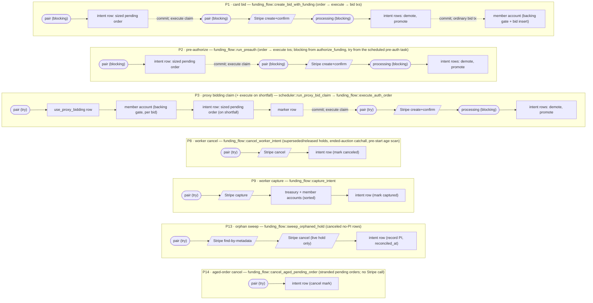
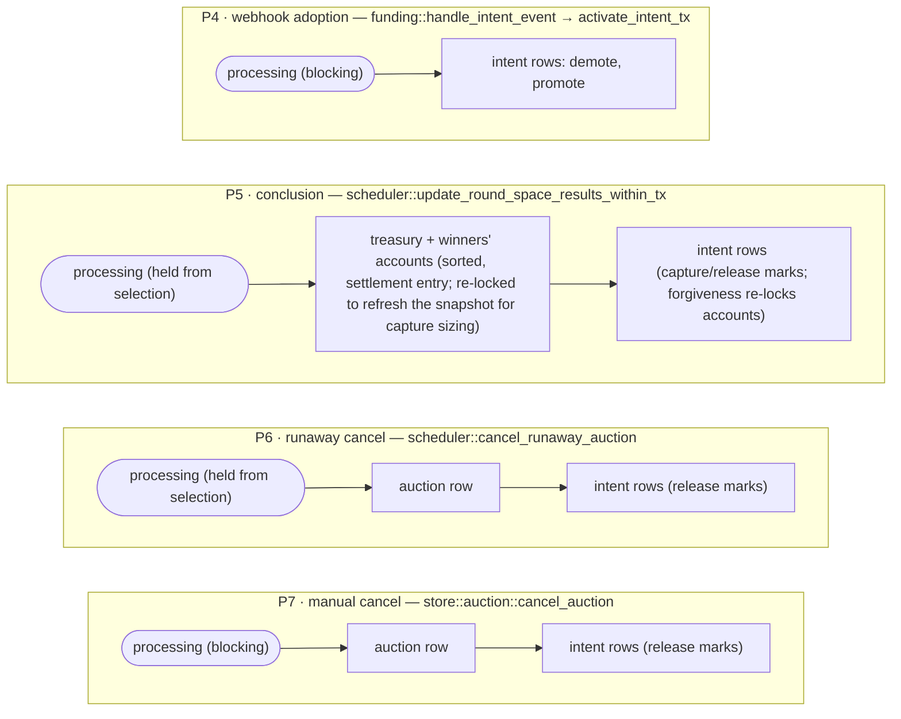
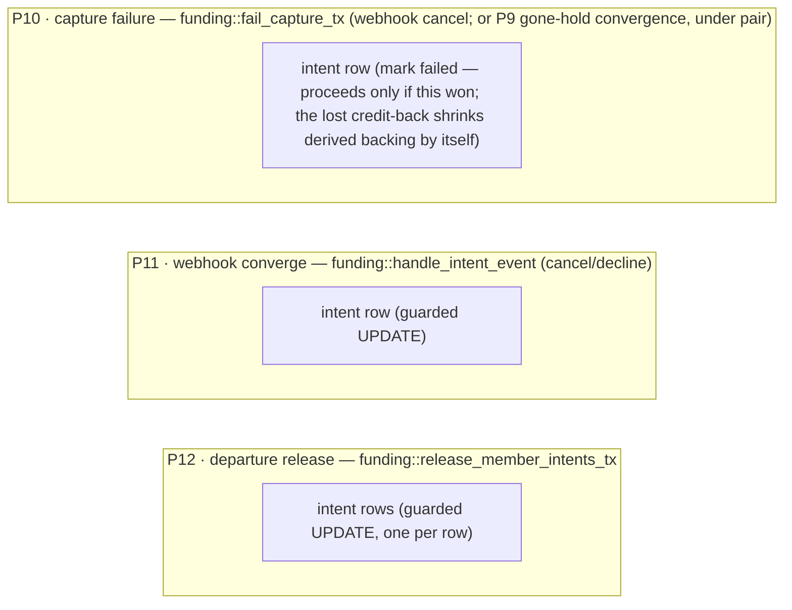

# Concurrency and lock ordering

Developer reference for the locking design coordinating auctions, bidding,
and card funding (`src/store/funding.rs`, `src/store/currency.rs`,
`src/store/auction.rs`, `src/store/funding_flow.rs`,
`src/scheduler.rs`).

This file is the single authoritative statement of the model. The
division of labor: this file owns the model and the pairwise safety
arguments; module docs own their module's piece of the map plus any
shared derivations; function docstrings own a one-line summary, the
`Lock contract:` line (grep for it), and a pointer here. A change to a
locking path updates both the contract line and this file. The
funding-intent *state machine* (statuses, transitions, owners) is
documented in `src/store/funding.rs`'s module docs, not here.

The model's runtime enforcement point is `src/store/locks.rs`: every
tracked acquisition flows through `TrackedTx` (which runs the SQL and
records the acquisition, checking the composition rules below), advisory
preconditions are asserted against the record with key-checked
`expect_*` calls, and savepoint scopes share the transaction's record so
rollback unwinds exactly the locks Postgres releases. One policy the
enforcement asserts: advisory locks are acquired only outside
savepoints.

## Rules of thumb

The short form of the model. Each rule is argued in full below; new
code follows them unless it can make the argument for an exception
here.

- Take the pair lock first or not at all.
- The processing lock is acquired holding nothing or holding the pair
  lock, never the reverse.
- Account rows are one sorted batch acquired up front; never extend
  the set later.
- No row lock spans a Stripe call.
- Webhook handlers never block on locks; they make guarded convergent
  writes.
- Advisory locks are never acquired inside savepoints.
- Member-present flows block on locks; workers try and skip.
- A transaction never waits on a second pool connection; only entry
  points take `&PgPool`.

## Glossary

The funding vocabulary, defined once:

- **order** — a committed `pending` intent row carrying
  `requested_amount`: the immutable instruction an execute claim replays
  at Stripe. Its id seeds the Stripe idempotency key.
- **execute claim** — the pair-locked transaction that replays an order
  at Stripe (create+confirm) and activates the result
  (`funding_flow::execute_auth_order`).
- **claim** — any try-lock-guarded transaction that admits one actor to a
  piece of work; losers skip, and state-driven re-selection retries.
- **activation** — promoting a confirmed intent to the (member,
  auction)'s single active authorization (`activate_intent_tx`): demote
  the predecessor, promote the new row.
- **demote / promote** — activation's two writes: the predecessor loses
  `is_active` (and `authorized` → `superseded`); the new row becomes the
  active authorization.
- **adoption** — webhook-driven activation of an orphaned pending row
  when the finalize write never ran (`handle_intent_event`).
- **live authorization** — an active `authorized` intent inside its
  capture window (`is_live_auth`); the only backing bids may count on.
- **swap / raise** — replacing a live authorization with a larger one:
  mint a new order, execute it; activation demotes the old row to
  `superseded` and the worker cancels the old hold at Stripe.
- **release** — marking a hold `release_pending` (nothing owed) for the
  worker to cancel at Stripe.
- **converge** — a status-guarded single-row UPDATE that moves a row only
  if it is still in the expected state; the loser of a race becomes a
  no-op instead of an error.
- **balance commitments / backing** — the derived funding quantities
  (`max(0, commitment − live auth)` per live auction; unallocated =
  balance + Σ pending captures − Σ balance commitments). Nothing stores
  them; the gates compute them under the member's account lock
  (`funding.rs` module docs).

## The model

There is deliberately **no single strict lock order**. Safety is layered,
and every potential deadlock is ruled out by one of three arguments:

1. **Advisory locks partition paths into exclusion classes.** Two
   transaction-scoped advisory locks serialize whole paths against each
   other, making their internal row-lock orders mutually irrelevant.
2. **Paths that can still overlap use compatible row orders.** Where two
   concurrent paths lock the same rows, they acquire them in the same
   direction, and multi-account acquisitions are always sorted batches.
3. **Or they touch provably disjoint rows.** Status guards and auction
   scoping keep some path pairs from ever contending on the same rows.

The pairwise table at the bottom records which argument covers which pair.

## Principles

The design rules the locking below follows. Hold new code to them:

1. **Every lock guards named races.** A lock earns its place by the
   specific interleavings it forecloses (listed per lock below). If you
   cannot name the race, the lock should not exist. Corollary: fix a
   race by naming it first, and prefer the narrowest mechanism that
   closes it. A status-guarded UPDATE or a re-check under an existing
   lock beats a new lock.
2. **Locks are held for the shortest span that closes their races.** No
   row lock ever spans a Stripe call. The processing lock inside
   activation covers exactly the intent-row writes. Claims commit as
   soon as their protected writes exist. One scoped exception: the
   notification drain (`scheduler::process_notification_outbox`) holds
   an outbox row lock across its email send. That is permissible
   because the drainer is that row's only writer, so nothing real ever
   queues behind it, and the lock is precisely what stops a concurrent
   drainer from double-sending (`FOR UPDATE SKIP LOCKED`). Its claim
   runs on the worker pool, like every transaction spanning a network
   call, so the pinned connection never starves the API pool.
3. **Transactions are scoped to what must commit atomically.** A
   transaction is a unit of atomicity, not a convenience scope. Writes
   that can converge on retry (guarded updates, idempotency keys) belong
   in their own transactions. Real-world state (a Stripe authorization)
   commits the moment it exists; everything downstream is separate and
   retryable. The order → execute → bid split is the canonical
   instance: the order transaction commits the verified, sized need
   (`ensure_pending_intent_tx`), the execute claim replays it at
   Stripe with parameters that are a pure function of the committed row,
   and the bids follow separately.

## Holder criteria — what each lock is for, and when to hold it

The question this section answers for every lock: *must my new code path
hold it?* Each criterion is a rule, not a list of current holders; the
paths section below is the derived map.

### `auction_user` pair lock

One lock deliberately serving **two duties** with the same scope. Both
exclusion domains are one member in one auction, so mutual serialization
costs nothing real (the worst case is a member's own re-click waiting
~1s behind their own proxy task) and buys the simple invariant: **at
most one funding/bidding actor per (auction, user) at a time**. Splitting
into two locks would require a documented nesting order between them and
a re-audit of every pairwise argument, without closing a nameable race.

**Duty 1 — Stripe-lineage mutex.** Hold iff the transaction reads the
intent lineage (the pending order, the live authorization) to decide a
Stripe mutation, or performs one. Holders: the order transactions (bid
flow, pre-authorize and the scheduled pre-auth task via the shared
`run_preauth` core, and the proxy bidding claim, whose duty-2 hold
doubles as its order authority when a funding-short bid sizes an order
in place), the execute claim, worker cancel (including the age-scan
arm), worker capture, and the reconciliation pass's orphaned-hold sweep
(its metadata probe decides a Stripe cancel). Races closed:

- Two claims for the same member+auction double-minting or
  double-swapping intents across a Stripe call. The pending row is the
  idempotency-key seed, and concurrent Stripe sequences on one lineage
  could reuse a key with different parameters.
- An order sized while an execute claim is mid-flight: without the
  lock, the sizing read counts the in-flight authorization as absent
  and sizes the full gap, minting a duplicate hold. Blocking on the
  pair lock makes the order wait out the in-flight execution and size
  only the residual. **This is why the pure-DB order transactions hold
  the lock despite making no Stripe call.**
- Worker arms repurposing an intent lineage a claim is mid-flight on
  (e.g. the ended-auction catchall canceling an authorization an
  execute claim is about to swap).

**Duty 2 — work-claim token.** Try-hold iff claiming a proxy item's
bidding pass (`run_proxy_bid_claim`). Race closed: two scheduler
instances (or overlapping selector passes) re-placing the same member's
bids concurrently. The same hold is what lets the claim act as its own
order transaction (duty 1) when a bid comes up short: proxy bidding
never overlaps a same-member card sequence, so bid re-placement always
sees settled lineage state and may extend it.

Acquisition mode: member-present flows block (the member is waiting on
the result); workers try and skip, relying on state-driven re-selection
to retry.

**Non-holders, deliberately:** settlement and cancel marking (they hold
the processing lock instead), settings writes, and webhook handlers.
For handlers the exclusion is load-bearing: our own confirm calls fire
`amount_capturable_updated` while a claim holds the pair lock, so a
lock-taking handler would deadlock with the very call that triggered
it. The webhook rule: handlers never block on locks. They make guarded
convergent writes (status guards, monotonic expressions) so either
delivery order converges. When the payload can't be trusted or is
incomplete, a handler may decide from a lock-free, pre-transaction
retrieve of the object's live state: retried payloads can be stale
(`account.updated` re-fetches account state), and intent payloads lack
the per-charge capture window (adoption retrieves the PaymentIntent).
Neither retrieve holds a lock or a transaction, so the
no-Stripe-calls-under-locks protection is untouched.
Two more non-holders sit in the reconciliation pass. The invariant
checker runs each community's pure-DB suite in one REPEATABLE READ
READ ONLY transaction with **no locks at all**: the invariants hold at
every commit boundary, and a repeatable-read snapshot is exactly the
state after some prefix of committed transactions, so any violation
visible in it is real and the checker contends with nothing. (READ
COMMITTED would tear across the multi-query commitment computation.)
The live-PI cross-check likewise takes no lock and holds no
transaction across its retrieves. It is read-only in both directions
(GET at Stripe, no local writes; detection only), and its one race — a
row transitioning mid-retrieve — is closed by re-reading the row
afterward and discarding the finding if it moved.

### auction-processing lock

Hold iff mutating the auction-level lifecycle — concluding/settling a
round, canceling the auction — or activating an intent
(`activate_intent_tx` acquires it inside every activation, including
webhook adoption). Races closed:

- An activation's demote/promote interleaving a settlement or cancel
  pass between its snapshot and its marks: the intent worker could then
  Stripe-cancel the demoted row the pass was about to mark
  `capture_pending`. Serialized, an activation lands wholly before the
  pass (sized or released normally) or wholly after (caught by the
  worker's ended-auction catchall).
- Scheduler passes and `cancel_auction` racing each other (double
  settlement / settle-after-cancel).

Nesting rule: a pair-lock holder may blocking-acquire the processing
lock (`activate_intent_tx`); **processing holders never take pair
locks**. That one-directionality is what makes the two namespaces safe
to nest.

### Account rows (`TrackedTx::lock_accounts`)

Hold iff reading a balance that decides a write in the same transaction
(the funding gates, journal entries). Race closed: balance
read-modify-write tearing (`balance_cached` vs journal lines). For
backed_credits the account lock is also the member-level funding
mutex: the gates derive balance commitments and unallocated balance
inside the transaction that holds the member's row, so two gates for
one member serialize here. `activate_intent_tx`'s shrink guard joins
this class for its reduction allowance: a checkout completion may
replace a larger hold only at or above the auction's commitment less
its balance backing, and it measures both terms holding the member's
row. The bid gate holds no pair or processing lock, so without the row
a gate could commit a bid (or an outflow could spend the measured
balance) against the larger hold the reduction is about to demote.
Always a single sorted batch acquired up front through
`TrackedTx::lock_accounts` (or its by-owner/community variants); the
sorted batch is the only thing making cross-member account contention
safe everywhere. Never extend the set with later acquisitions
(checked: a later acquisition must be a re-lock of already-held rows).

### `use_proxy_bidding` row

Hold to clear the `needs_processing` dirty flag. Race closed: the clear
racing a member's settings write (a lost flag set). Concurrent settings
writers block on the row, land strictly after the claim commits, and
re-set the flag.

### `funding_intents` rows

Not mutual exclusion — single-row status-guarded UPDATEs converge
transitions; contention is incidental. If you are reaching for an intent
row lock to serialize a sequence, you want the pair lock (duty 1).

### `communities` row

Wind-down serialization for community deletion. `delete_community`
takes the row FOR UPDATE inside its delete transaction, then re-runs
the in-flight-payments guard there. FOR UPDATE is the one mode that
conflicts with the FOR KEY SHARE every payment-mint transaction holds
on the row until it commits (implicitly via the `credit_purchases`
community FK's referential-integrity check; explicitly in
`ensure_pending_intent_tx`, whose FK chain reaches communities only
through `auctions` and `sites`, so the auction row is all the FK
locks). A mint therefore either commits strictly before the guard,
which sees its row and refuses the delete, or blocks on the lock and
fails on the missing community after the delete commits. In both cases
the outcome lands before the mint's Stripe call. Race closed: a
purchase row or
authorization order committing between guard and delete,
cascade-deleted with a live Stripe object attached (money moved with
no local record, invisible to reconciliation).

## Lock inventory

| Lock | Scope | Kind |
|---|---|---|
| `auction_user` pair lock | one member × one auction | advisory, xact-scoped; try-lock except member-present claims |
| auction-processing lock | one auction | advisory, xact-scoped |
| account rows | community accounts | row locks, always a sorted batch (`TrackedTx::lock_accounts`) |
| `funding_intents` rows | one authorization | row locks, mostly single-row guarded UPDATEs |
| `use_proxy_bidding` row | one member's proxy config | row lock |
| `auctions` row | one auction | row lock |
| `credit_purchases` row | one purchase | row lock, succeeded-webhook applier and the settlement supersede UPDATE |
| `communities` row | one community | row lock; FOR UPDATE in `delete_community`'s wind-down guard vs FOR KEY SHARE held to commit by payment-mint transactions (credit-purchase FK, explicit in `ensure_pending_intent_tx`) |
| reconciliation pass gate | global | advisory, xact-scoped, try-lock (`store::reconciliation::try_claim_reconciliation_pass`) — deduplicates the hourly run-all pass across instances; held across the pass (a worker-pool transaction) so the watermark restamp commits with it |

## Paths and their acquisition sequences

Legend: rounded nodes are advisory locks, rectangles are row locks,
slanted nodes are Stripe calls (long-held spans — everything to their
right is the short finalize tail).

### Pair-lock class — serialized per (auction, user)

The order transaction verifies and sizes the card need once, under the
pair lock, and commits it as the pending intent row; the shared
execute claim (`funding_flow::execute_auth_order`) replays that
committed order at Stripe. For the proxy path the order transaction is
the bidding claim itself: a bid failing on funds proves the exact need,
so the claim sizes and commits the order in place
(`funding_flow::order_proxy_bid_auth_tx`) and the execute claim runs
after its commit, followed by a re-entered claim consuming the new
backing. Because the pair lock drops between the two, the execute claim
re-checks one thing — the order must still exceed the live hold — and
cancels stale orders instead of executing them. P1's bid transaction
and P3 are where new backing is consumed. Activation commits first and
needs no atomicity with them: an authorization without bids is a legal
state, and the pre-authorize flow (P2) produces exactly it. P3's
bidding runs in a savepoint so a failure is recorded on the outcome
marker. P9 attempts capture even past `capture_before` (the
idempotency-key replay converges a capture that succeeded before a
crashed commit), and when Stripe reports the hold gone it retrieves
live state and converges, running P10's sequence under the pair lock.
P8's age-scan arm re-verifies pre-start and short-window under the
claim and skips rather than canceling a hold that is live again: the
auction may have started, or a raise may have swapped the hold, since
the lock-free selection.

### Processing-lock class — serialized per auction

The activation transactions of P1, P2, and P3 above are also members
of this class (that is the point of `activate_intent_tx` taking the
lock).

Backing is derived, so conclusion and cancellation have nothing to
release on the balance side: the posted `end_at` drops the auction from
every derived aggregation. P5's capture sizing reads other live
auctions' balance commitments for each winner. These are plain reads
under the account locks the settlement entry already holds; no
funding-side row lock exists.

### No advisory locks — single-row convergers

## Why the card flows are order → execute → bid

Three transactions, each scoped to one unit of atomicity (principle 3):

- The **order** transaction verifies and sizes the card need exactly
  once, under the pair lock, and commits it as the pending intent row
  with `requested_amount`. That row is the authorization order: its id
  seeds the Stripe idempotency key and its amount fixes the create's
  parameters, so every replay of the execute step is byte-identical and
  converges at Stripe. Re-sized retries (the old
  same-key-different-params 400) cannot arise. Orders are immutable in
  place: a stranded order whose amount covers a later need is reused
  as-is, and one that can't cover it is canceled and re-minted at the
  new size. Orders are never edited, because a crashed attempt may
  have created a Stripe object with the old parameters.
- The **execute** claim replays the order. `activate_intent_tx` runs
  immediately after the Stripe call and the claim commits right there:
  the authorization is real-world state that must persist regardless of
  what the bids that consume it do. Its only re-check is one row read:
  the order must still exceed the live hold. (The pair lock drops
  between order and execute; a stale order is canceled, since executing
  it would swap-demote the larger hold.)
- The **bids** run as ordinary later transactions. The intermediate
  state, an authorization with no bid, is already legal: the
  pre-authorize flow produces it deliberately, an idle authorization is
  released at auction end, and a retry sizes only the residual gap
  without a second Stripe call.

A consequence worth preserving: no order or execute transaction ever
holds intent rows together with account locks, which keeps the card
flows out of every row-ordering argument below.

## Pairwise safety arguments

Only pairs that can genuinely overlap *and* share rows need an argument.
Same-pair paths and same-auction processing-class paths are excluded
outright by their advisory locks.

| Overlapping paths | Shared rows | Why no deadlock |
|---|---|---|
| bid transactions (P1's bid, P3) × conclusion P5 / capture P9 (different auction, common member) | member account | All sides take accounts as sorted batches before anything else they share; the derived balance-commitment reads inside the gates and P5's sizing are plain reads under those account locks, with no funding-side row category left to contend on. Intent targets stay auction-scoped and disjoint. |
| order and execute transactions (P1 / P2 / P3 / P4) × anything | intent rows | They hold only advisory locks plus intent rows — a single contended row category, so waits are one-directional. |
| conclusion P5 × fail_capture P10 | none (intent targets only) | Intent targets are status-disjoint: P5 marks only rows it selected as `authorized`; P10 only ever locks a `capture_pending` row (which P5 itself creates, later). P10 holds nothing else. |
| capture P9 × fail_capture P10 (same intent) | the intent row | P10 holds only the intent row; P9's account locks precede its intent write, so the wait is one-directional. Occupying conflicting states at once would need one PaymentIntent to have both capture-succeeded (P9's success path) and been canceled (P10's trigger) — impossible in Stripe's state machine. The status guards make whichever side loses a no-op. |
| settlement/cancellation passes (P5 × P5′/P6/P7, cross-auction) / capture P9 | treasury + member accounts | All multi-account acquisitions are sorted batches (`TrackedTx::lock_accounts`). Intent targets stay auction-scoped and disjoint. |
| P8 / P11 / P12 / P13 / P14 × anything | single intent rows | They hold at most one contended lock at a time; a cycle needs a path holding one lock while waiting on another. |
| purchase issuance (webhook `payment_intent.succeeded`) × anything | purchase row → accounts | The purchase row is locked only by this applier and the settlement supersede UPDATE (below); redundant deliveries serialize on it, the entry idempotency key is the once-only guarantee, and no other path holds account locks while waiting on a purchase row, so the purchase-row → sorted-accounts order cannot form a cycle. |
| settlement creation × purchase issuance (webhook) | `created` purchase rows | Creation takes no advisory locks; its supersede UPDATEs are single autocommit statements, so it never holds a purchase row while waiting on anything else. Concurrent creations are resolved by the post-mint survivor election (`store::purchases` module docs), not mutual exclusion. The Stripe expire calls that pair with the supersede (the stale-session sweep, the mid-mint re-check) run outside any transaction — no lock spans them. |
| community delete × mint / ledger transactions | the community row; cascade-deleted rows | The one place a detected deadlock is accepted rather than excluded by ordering: a transaction already holding account rows that then requests the community KEY SHARE (the proxy order path, any journal insert's FK check) can cycle with the delete, which holds the community row from before its guard through the cascades. Bounded and benign — it requires a concurrent delete of that same community, Postgres aborts one side, and both retries converge: an aborted mint re-runs and finds the community gone; an aborted delete re-runs its guard. Not worth the alternative (a KEY SHARE first in every claim transaction) for a rare manual operation. |

Webhook convergence against the settle marks (P11 × P5) is not a lock
question but a guard question: the marks re-check `status = 'authorized'`
so a webhook-canceled row is left alone and the settlement debit stands
as immediate honest debt (documented at the mark site in
`settle_auction_funding_tx`).

## Maintenance notes

- The `Lock contract:` docstring lines are the per-function ground truth;
  this file is the assembled picture. A change to either updates both.
  Each line is enforced by its function: key-checked `expect_*` calls
  for advisory expectations, `TrackedTx`'s recorded acquisitions for
  everything it takes itself.
- Advisory locks are acquired only through `TrackedTx` (`acquire_pair`,
  `acquire_processing`). Two exceptions: the scheduler's selection query
  (`lock_next_auction_needing_update`), whose try-lock must stay
  embedded in the selection SQL (recorded post hoc via
  `TrackedTx::assume_processing_locked`), and the global single-key
  pass gates. Both gates serialize whole passes, never nest with the
  entity locks, and stay untracked. Storage refresh is a self-contained
  single-statement try-lock. The reconciliation gate's try-lock
  transaction is held across the pass so the watermark restamp commits
  with it, and it runs on the worker pool since the pinned connection
  idles for the pass's Stripe-heavy duration (see the lock inventory
  row).
- The intent state machine (statuses, transitions, and which function
  owns each edge) lives in `src/store/funding.rs`'s module docs; keep it
  there, not here, so it sits next to the transition code.
- The plan document's Concurrency section
  (`docs/plans/stripe-auction-payments-implementation.md`) is design
  history, superseded by this file; don't update it.
- Savepoint caveat: row locks acquired inside a savepoint are released if
  it rolls back. Advisory locks and pre-savepoint row locks survive; the
  claims rely on this (the processing lock and intent-row writes precede
  the bid savepoint). `TrackedTx::savepoint` mirrors the semantics in
  the lock record: explicit rollback truncates the scope's entries,
  commit keeps them.
- Account locks must always go through `TrackedTx::lock_accounts`
  (sorted batch) — it is the only thing making cross-member account
  contention safe everywhere.
