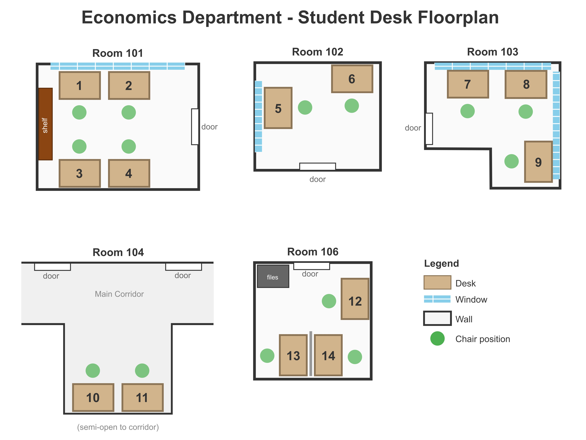

# Student Desk Scenario

## Overview

TinyLVT is a platform designed to help communities share scarce resources. Help test it by participating in this hypothetical scenario.

Read the scenario description, select a character archetype, then participate in the TinyLVT auction according to the imagined preferences of your character. Afterwards, you'll give feedback about the experience.

The auction begins at Sun, 14 Dec 2025 at 12:00 PST. Enter your preferences before then! 

## Scenario

You're a graduate student in the economics department of Henry George Junior University, a prestigious institution of higher education in the United States. The econ department has grown in recent years, leading to a shortage of student desks, and the department wants to try using TinyLVT to allocate them among the students.

The system is simple: desks are auctioned for the next academic quarter to the highest bidders. The proceeds of the auction are redistributed equally to all the econ grad students, reflecting their equal right to use the desks. Though only the auction winners get to use the desks, those that are excluded still receive an equal share of the desks' value.

The department expects to see some positive effects from this system. Desks are allocated to those with the highest value for the desks, and who will be most likely to actually use the desks. In the past, when desks were assigned to people by lottery or seniority, some desks would sit unused because the assignee didn't value the desk very much and would spend most of their time elsewhere. With the auction, desks will go to people that value the desks the most, and the payment ensures they're incentivized to use their desks well.

Moreover, those who want a desk but don't get one in the auction still receive a sum of money that they can use to win a desk in a future auction. If a desk is what a student wants, their equal distribution gives them one share of the desk value, which they can use to access one equal share of the desks in future quarters.

The department will auction 14 desks across 5 locations with this floor plan:

Prices are the cost of possessing a desk for the full 3-month quarter. 

## Character Select

Determine a set preferences that influence how much value you place on the desks and how much you'll bid in the auction. These include your value for:
- getting any desk at all
- the better desks relative to the worse ones
- privacy
- quietness
- window views and natural light

What is a cohesive story for your character? Are you a senior grad student with a strong preference for window-facing desks? Are you a new grad student who wants to be around other people? How much are you willing to pay to have your preference?

Assume that you receive a stipend of $55k/year, of which the majority is spent on living expenses. You can only meaningfully spend a couple hundred dollars, perhaps a thousand dollars at most, on the use of a desk for a quarter, if you really want it.

Since this is the first time the department is doing this, you don't know how much the desks will be worth, or how much you'll get back from the redistribution.

## Auction Format

The proxy bidder will handle participation in the auction for you. You don't need to know the exact details of the auction format. However, the auction details may still influence how you bid and how you view the result of the auction.

To use proxy bidding, assign your values, the maximum you would pay, for each desk you want. The proxy bidder will bid on your behalf for the desk where there is the greatest difference between your value and the current desk price.

Prices for all desks climb progressively higher all together. This way you, or the proxy bidder, can shift your bidding between desks as the prices get revealed.

Among bidders for a desk, a standing high bidder is selected at random for each round. A standing high bidder cannot release a desk until they are outbid by another person.

You must bid on a desk or be the standing high bidder on a desk in every round of the auction. You cannot wait to start bidding only in later rounds. This requirement ensures that everyone participates in price discovery as the auction progresses.

This is encoded by assigning each desk 1 eligibility point, and every round has a 100% eligibility threshold. This means that you must bid for at least 1 point (1 desk) in every round for as long as you intend to continue participating. Once you drop out of the auction, you can't rejoin.

The round duration is 1 minute, and the bid increment is $10. If the maximum desk price is $1000, the auction will run for at least 100 rounds.

## Directions

1. Go to [tinylvt.com](https://tinylvt.com) and create an account. Your username will be visible to other participants, but your email will not be.
2. Verify your email address by opening the link sent to your inbox.
3. Join the student desks scenario community at [this link](https://tinylvt.com/accept-invite/a738961b-e9c7-4303-bc86-c775209314d3).
4. Navigate to the "Econ Department Student Desks" site, then to the quarterly desk auction. Assign your values to each desk you want. Make sure proxy bidding is enabled with at most 1 space to win. When the auction starts, the proxy bidder will bid on your behalf for the desk where there is the greatest difference between your value and the current price.
5. Upon conclusion of the auction, check for the auction results on the auction page, which shows the desk assignments and the payments the winners must make. The per-person payout will be the sum of all payments divided by the number of community members. This value will be posted on this page for your reference.
6. Consider your reaction to the result. Did you get a desk you wanted? If so, how do you feel about the price? How do you feel about the redistribution?
7. Fill out [the survey](https://tally.so/r/ODar4p) with your thoughts.
